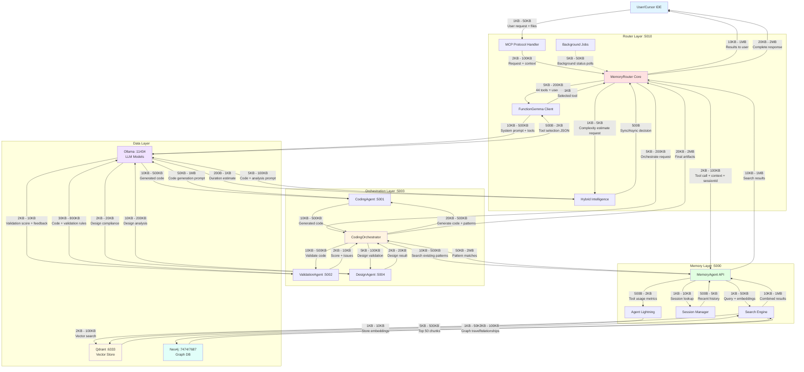
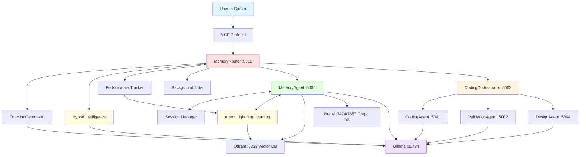
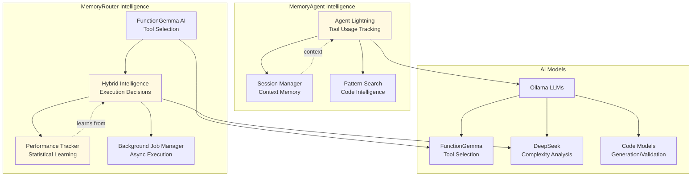
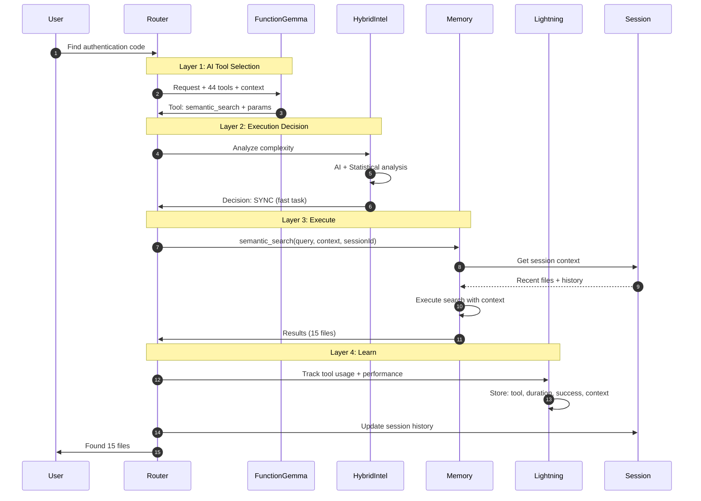
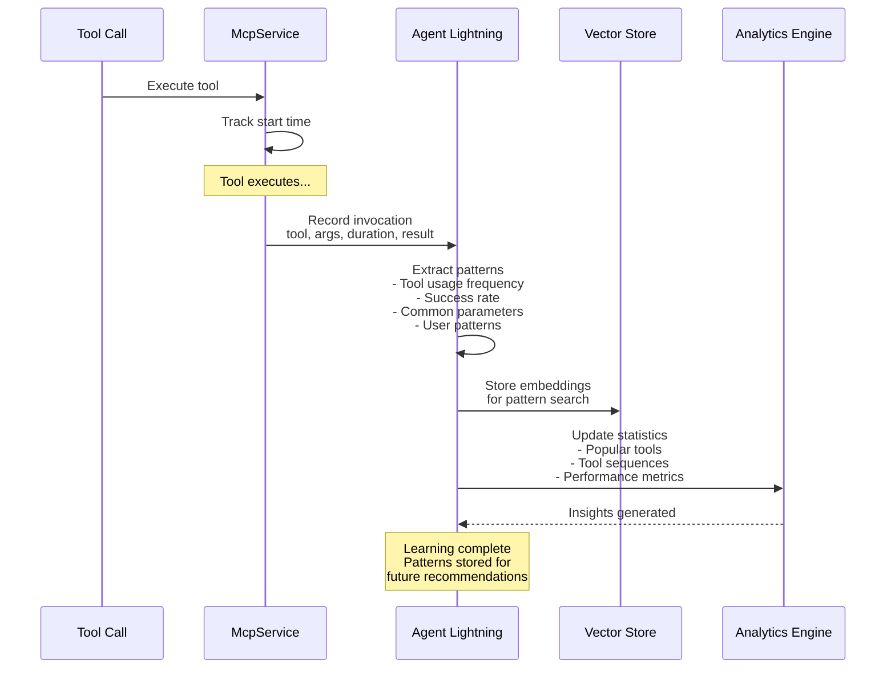
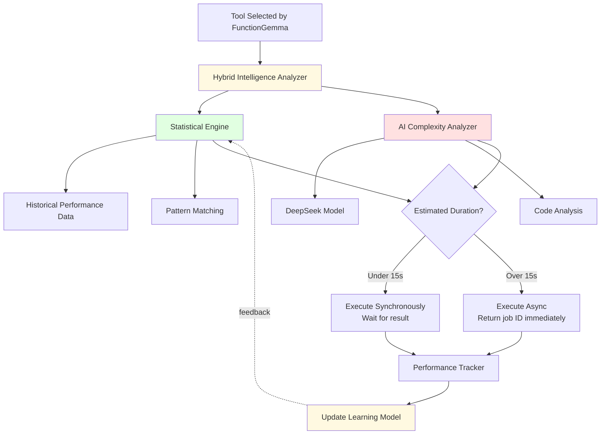
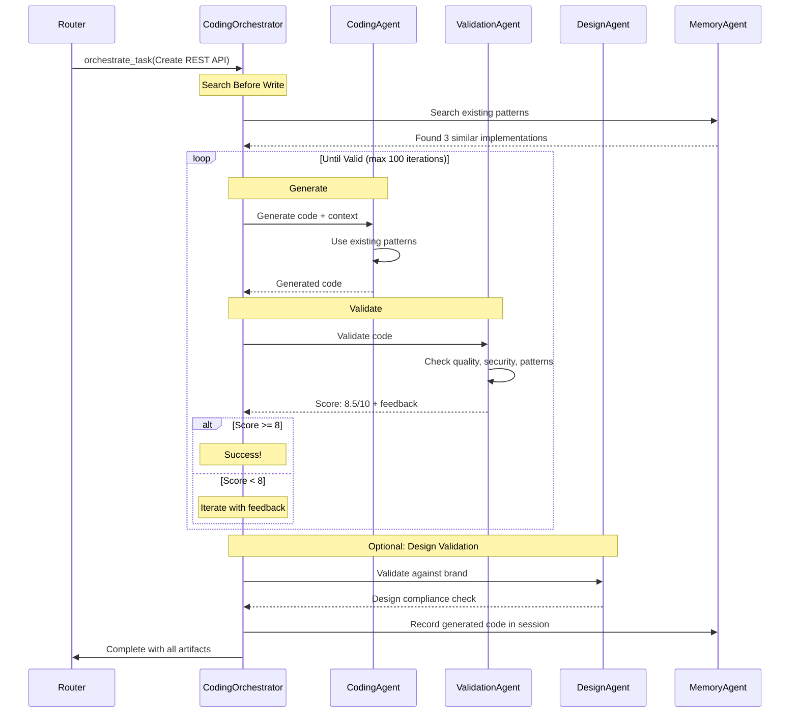
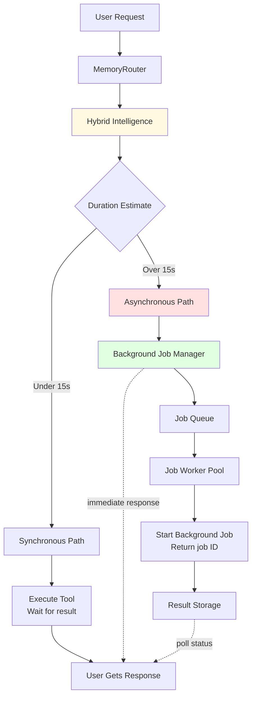

# MemoryAgent Architecture

## Full System Communication & Context Flow

## Complete System Architecture

## Intelligence Stack

## Request Flow with All Intelligence

## Agent Lightning Learning Flow

## Hybrid Intelligence Decision Making

## Multi-Agent Orchestration

## Background Job Architecture

## Tool Distribution

### MemoryAgent (33+ tools)
- **Search**: semantic_search, smart_search, graph_search
- **Analysis**: explain_code, impact_analysis, complexity_analysis
- **Validation**: validate_pattern, search_patterns
- **Learning**: start_session, record_context, get_insights, get_tool_usage
- **Planning**: create_plan, estimate_complexity
- **Transform**: transform_page, transform_css
- **Intelligence**: get_recommendations, get_popular_tools

### CodingOrchestrator (11+ tools)
- **Generation**: orchestrate_task, get_task_status, cancel_task
- **Design**: design_create_brand, design_validate, design_get_brand
- **Management**: list_tasks, get_generated_files

### MemoryRouter (2 MCP tools)
- **execute_task**: Smart routing with FunctionGemma
- **list_available_tools**: Discover all tools

## Intelligence Features

### Agent Lightning
- Tool usage tracking
- Performance metrics
- Pattern detection
- User behavior learning
- Tool recommendations
- Success rate analysis

### Hybrid Intelligence
- Statistical learning from history
- AI complexity estimation
- Automatic sync/async decisions
- Performance prediction
- Continuous improvement

### Session Intelligence
- Context memory across requests
- File discussion tracking
- Query history
- Smart follow-up handling
- Conversation continuity

### Search Intelligence
- Semantic vector search
- Graph relationship traversal
- Pattern matching
- Context-aware ranking
- Multi-strategy optimization
